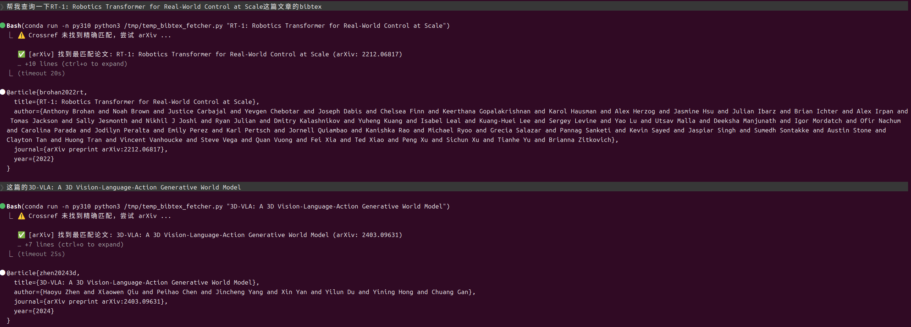

# fetch-bibtex

A Claude Code skill that fetches **authentic** BibTeX entries from Crossref and arXiv APIs — never hallucinated.

## Demo



## What it does

When you give it a fuzzy paper title, it:

1. Queries **Crossref** first for a DOI-based BibTeX
2. Falls back to **arXiv** if Crossref has no match
3. Returns the real BibTeX — refuses to guess or fabricate metadata

## Install

```bash
npm install fetch-bibtex
```

Or install directly from GitHub:

```bash
npm install xinmo-zhisuan/Skills#main:fetch-bibtex
```

The `postinstall` script will automatically copy the skill files into `~/.claude/skills/fetch-bibtex/`.

## Requirements

- Python 3.8+
- `requests` library (`pip install requests`)

If you use conda, the skill defaults to `conda run -n py310`. Edit `SKILL.md` if your environment differs.

## Usage

Just ask Claude naturally:

```
帮我查一下 Attention is All You Need 的 BibTeX
```

```
Find the BibTeX for "Deep Residual Learning for Image Recognition"
```

## File Structure

```
fetch-bibtex/
├── SKILL.md                  # Skill definition
├── scripts/
│   ├── bibtex_fetcher.py     # Core search script (Crossref + arXiv)
│   └── install.js            # npm postinstall script
├── package.json
├── README.md
├── LICENSE
└── .gitignore
```

## License

MIT
